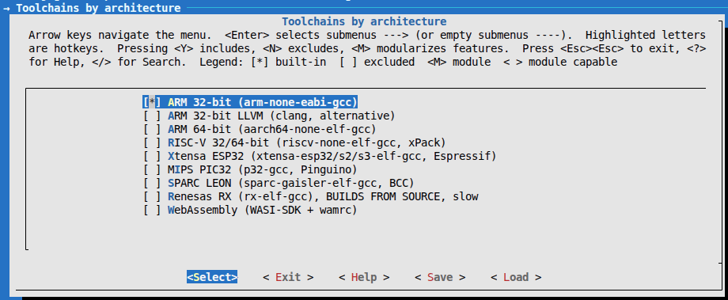

# NuttX SDK `v0.1.0`

A single place to hold every cross-toolchain [Apache NuttX](https://nuttx.apache.org/)
needs, installed on demand from a graphical menu. **No extra meta-tool to
learn**, just env vars and `make`.

## Introduction

NuttX runs on many architectures (ARM, RISC-V, Xtensa, ...), and each one
needs its own cross-toolchain. Normally you install each compiler by hand,
chase the right version for every target, and risk clashing with other
toolchains already on your machine.

The NuttX SDK solves that: it keeps **all** the toolchains in one place, lets
you pick what you need from a graphical menu (`get_nuttx -m`), and puts them
on your `PATH` only in the terminal where you ask for them. Install once, tick
a box when you add a new board, and never hand-install a compiler again.

## How it works

- **Versions come from NuttX CI, not from this repo.** The SDK installs a
  toolchain by running the NuttX tree's own CI installer
  (`nuttx/tools/ci/platforms/ubuntu.sh`), so you get exactly the versions
  Apache validates in CI. No version list is duplicated here, so nothing can
  drift.
- **Everything stays local.** Toolchains live under `toolchains/` and the
  Python tools under `python-venv/`, both inside the SDK directory. **Nothing
  is installed system-wide**, so the SDK never conflicts with compilers,
  `gdb`, or Python packages already on your machine.
- **Isolated Python env.** A virtualenv inside the SDK holds the pip tools
  NuttX uses (`esptool`, `kconfiglib`, `imgtool`, ...). It never touches your
  system Python.
- **Opt-in activation (like ESP-IDF's `get_idf`).** A normal terminal stays
  clean. You run `get_nuttx` to put the SDK on `PATH` only in that shell; open
  a fresh terminal and it is clean again.

## Getting started

### Prerequisites

- Linux x86_64.
- A few host packages (Debian/Ubuntu):

  ```console
  $ sudo apt install build-essential bison flex gperf libncurses5-dev \
                     genromfs git python3 python3-venv python3-pip curl \
                     kconfig-frontends
  ```

- The NuttX sources: the `nuttx` and `nuttx-apps` repositories. You do **not**
  clone these by hand, the installer does it for you (see below).

### 1. Download the SDK (into `~/nuttxspace`)

Keep the SDK next to the NuttX sources, all under `~/nuttxspace`:

```console
$ mkdir -p ~/nuttxspace && cd ~/nuttxspace
$ git clone https://github.com/JorgeGzm/nuttx-sdk.git
```

### 2. Install once

```console
$ ./nuttx-sdk/scripts/nuttx-install.sh
```

This checks your host prerequisites, creates the Python venv, and clones
`nuttx` + `nuttx-apps` into `~/nuttxspace`. It is idempotent: run it again any
time and it only updates what changed.

### 3. Enable the `get_nuttx` command

Add it to your `~/.bashrc` once (this only **defines** the command, it does
not activate anything):

```console
$ echo "source ~/nuttxspace/nuttx-sdk/get_nuttx.sh" >> ~/.bashrc
```

Open a new terminal, then activate the SDK in it:

```console
$ get_nuttx
```

### 4. Install a toolchain

Open the graphical menu (the same interface as NuttX's `make menuconfig`):

```console
$ get_nuttx -m
```



- Arrow keys move, **Space** ticks a toolchain `[*]`, **Enter** opens a
  submenu, **Esc Esc** saves and exits.
- On save, the ticked toolchains are downloaded and installed, and the
  environment is re-activated so they are immediately on `PATH`.

### 5. Build

First activate the SDK in this terminal, so its toolchains are on `PATH`:

```console
$ get_nuttx
```

Then configure a board and build. Because the toolchains are now on `PATH`,
`make -j` finds and uses the right compiler automatically, no `CROSSDEV` and
no extra flags:

```console
$ cd ~/nuttxspace/nuttx
$ ./tools/configure.sh gd32vw553k-start:nsh   # any board:config
$ make -j$(nproc)
```

From here on it is the stock NuttX workflow (`configure.sh`, `make`,
`make menuconfig`), unchanged. Remember to run `get_nuttx` once in every new
terminal you build from.

No board to try? Build the simulator, it runs as a normal Linux process:

```console
$ ./tools/configure.sh sim:nsh
$ make -j$(nproc)
$ ./nuttx        # nsh> prompt running on your PC
```

### Uninstall a toolchain

Same menu, untick it:

```console
$ get_nuttx -m
```

Untick the toolchain and save. The menu lists what you removed and asks
`Remove from disk? [y/N]` (default is **No**, so nothing is deleted by
accident).

## Using VSCode

For each NuttX project you open in VSCode, run once:

```console
$ cd ~/nuttxspace/nuttx
$ ~/nuttxspace/nuttx-sdk/scripts/nx-init-project.sh --arch riscv   # or arm, xtensa
```

This drops a `.vscode/` into the project with:

- **`settings.json`**, a terminal profile that activates the SDK and
  IntelliSense pointed at the selected toolchain (compiler, includes, and the
  `CONFIG_*` macros read from `.config`).
- **`tasks.json`**, `Ctrl+Shift+B` builds; tasks for `boards (filter)`,
  `configure`, `menuconfig`, `clean`, `distclean`, `size`, `serial monitor`,
  plus background debug servers (OpenOCD, QEMU).
- **`launch.json`**, press **F5** to debug. Ready configs for the simulator
  (host gdb), on-board attach via OpenOCD (`:3333`), QEMU RISC-V (`:1234`),
  and ARM cortex-debug. The ELF is always `${workspaceFolder}/nuttx` and gdb
  comes from the SDK toolchain.
- **`extensions.json`**, recommends the C/C++ and Cortex-Debug extensions.

Debug is board-specific: point `nuttxSdk.openocd` / `nuttxSdk.openocdCfg` in
`settings.json` at the OpenOCD binary and `.cfg` for your board. Flashing
itself stays out of the SDK's scope (ESP boards use `esptool.py`, etc.).

## Toolchain groups

The `get_nuttx -m` menu is organized into four categories. Each item maps to a
function in the NuttX CI installer, and the installed version is whatever that
tree pins in CI. Press `?` on any item in the menu for the same details.

### Toolchains by architecture

The cross-compilers, one per CPU family. Tick the one your board uses.

| Group     | Toolchain                                  | Typical targets                          |
| --------- | ------------------------------------------ | ---------------------------------------- |
| `arm`     | `arm-none-eabi-gcc`                        | STM32, nRF, RP2040, SAMD, LPC            |
| `armclang`| LLVM-embedded for ARM                      | Cortex-M (clang builds, rare)            |
| `arm64`   | `aarch64-none-elf-gcc`                     | RPi 3/4/5, Allwinner A64                 |
| `riscv`   | `riscv-none-elf-gcc` (xPack)               | GD32VW55x, ESP32-C/H/P, CH32V, K210, Pico 2 RV |
| `xtensa`  | `xtensa-esp32/s2/s3-elf-gcc` (Espressif)   | ESP32, ESP32-S2, ESP32-S3                |
| `mips`    | `p32-gcc`                                  | PIC32 (Pinguino)                         |
| `sparc`   | `sparc-gaisler-elf-gcc`                    | LEON3/LEON4                              |
| `rx`      | `rx-elf-gcc`                               | Renesas RX (builds from source, slow)    |
| `wasi`    | WASI-SDK + wamrc                           | WebAssembly                              |

The `riscv` xPack build ships the `rv32imafc/ilp32f` hard-float multilib
required by targets like the GD32VW55x.

### Manufacturer SDKs

Vendor sources that complement a toolchain (not compilers on their own).

| Group  | What                  | Notes                                       |
| ------ | --------------------- | ------------------------------------------- |
| `pico` | Raspberry Pi pico-sdk | Needed for Pico / Pico 2. Only selectable once `arm` or `riscv` is ticked. |

`kconfig-frontends` is a required prerequisite, not a menu item:
`configure.sh` and `make` need it to generate `.config`, so it is installed
from the distro (`sudo apt install kconfig-frontends`, already in the
prerequisites above) and checked by `nuttx-install`.

### Debug / flashing

Flashing and debug tools (outside the build).

| Group     | What            | Use                                             |
| --------- | --------------- | ----------------------------------------------- |
| `openocd` | `openocd-esp32` | JTAG for ESP32 chips. The only item not from CI (CI does not flash hardware). |

Tools NuttX CI installs via `apt`/`pip` stay on your distro/Python, same as in
CI: `avr-gcc`, `rust`, `ldc2`, `genromfs`, `gperf`, ...

## Layout

```
~/nuttxspace/
├── nuttx-sdk/                    # this repo
│   ├── get_nuttx.sh              # defines the get_nuttx command (source from ~/.bashrc)
│   ├── nuttx-env.sh              # activation script (sourced by get_nuttx)
│   ├── Kconfig                   # installable toolchain groups (menu + help)
│   ├── Makefile                  # make menuconfig / list / env
│   ├── scripts/
│   │   ├── nuttx-install.sh      # one-time installer (doctor + venv + repos + toolchains)
│   │   ├── sdk-menuconfig.sh     # graphical menu -> install/remove toolchains
│   │   ├── setup.sh              # CLI front-end (see Advanced)
│   │   ├── install-from-ci.sh    # runs nuttx/tools/ci/platforms/ubuntu.sh functions
│   │   ├── install-xpack.sh      # extras outside the CI set (openocd-esp32)
│   │   ├── extract-toolchains.sh # --docker path: extracts from the CI image
│   │   └── nx-init-project.sh    # adds .vscode/ to a project
│   ├── vscode-template/.vscode/  # template copied by nx-init-project
│   ├── python-venv/              # SDK pip tools (gitignored, created by nuttx-install)
│   └── toolchains/               # installed toolchains (gitignored) = $NUTTXTOOLS
├── nuttx/                        # cloned by nuttx-install
└── apps/                         # cloned by nuttx-install
```

Directory names inside `toolchains/` follow the CI's `$NUTTXTOOLS` layout
(`gcc-arm-none-eabi`, `riscv-none-elf-gcc`, `xtensa-esp-elf`, ...), so
activation works the same for both install modes.

## Advanced

Everything below is optional. The graphical `get_nuttx -m` covers the common
case; these are for scripting, CI, and power users.

### CLI install (no menu)

```console
$ ~/nuttxspace/nuttx-sdk/scripts/setup.sh --list        # show all groups
$ ~/nuttxspace/nuttx-sdk/scripts/setup.sh riscv          # install one group
$ ~/nuttxspace/nuttx-sdk/scripts/setup.sh arm riscv xtensa
```

`get_nuttx -m`, `make menuconfig`, and `setup.sh` (no args) all open the same
menu; `setup.sh <group>` installs without the UI (works at any terminal size).

### Pin versions to a specific nuttx tree

Versions are read from `nuttx/tools/ci/platforms/ubuntu.sh` of the tree in
use (found via `--nuttx`, `$NUTTX_BASE`, `../nuttx`, or `~/nuttxspace/nuttx`):

```console
$ ~/nuttxspace/nuttx-sdk/scripts/setup.sh --nuttx ~/nuttxspace/nuttx riscv
```

### Install from the CI Docker image

Instead of running the installer natively, extract the prebuilt toolchains
from the official CI image (`ghcr.io/apache/nuttx/apache-nuttx-ci-linux`).
Useful for the `rx` group, which otherwise builds from source.
Needs Docker and a ~6 GB pull:

```console
$ ~/nuttxspace/nuttx-sdk/scripts/setup.sh --docker riscv
```

### Update a toolchain

Versions live upstream. When NuttX bumps one in CI, delete the directory and
reinstall:

```console
$ rm -rf ~/nuttxspace/nuttx-sdk/toolchains/riscv-none-elf-gcc
$ get_nuttx -m        # tick riscv again, or: setup.sh riscv
```

### Activate in every shell (instead of opt-in)

If you prefer the SDK always active, source it unconditionally in `~/.bashrc`:

```bash
__nuttx_bashrc_done=1            # nuttx-env.sh won't re-source ~/.bashrc
export NUTTX_ENV_QUIET=1         # optional: no banner
source ~/nuttxspace/nuttx-sdk/nuttx-env.sh
```
